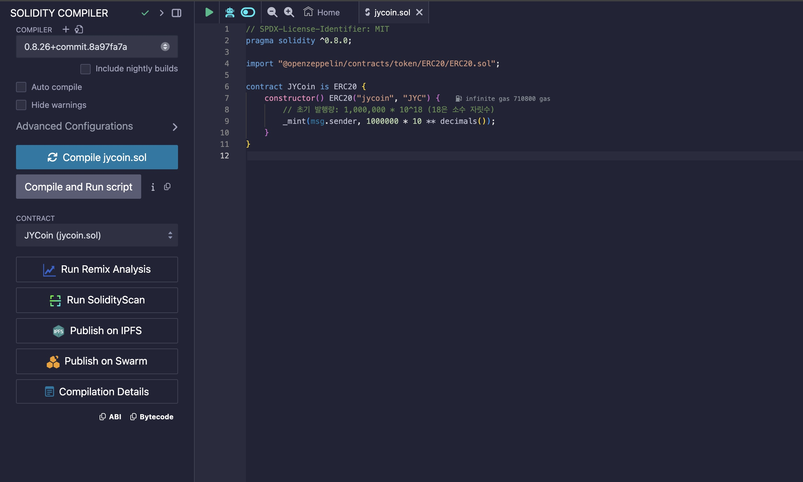
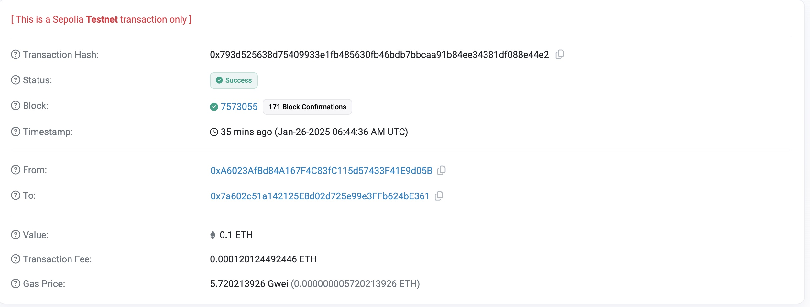

# JYC-token
ERC-20 토큰 생성 및 배포
- 사용 기술: Solidity, Remix IDE, MetaMask
- 주요 활동:
    - ERC-20 스마트 컨트랙트를 작성
    - 로컬 이더리움 네트워크에서 배포 및 테스트
    - 토큰 전송 및 확인
- 이론적 배경
    토큰이란? 
    : 토큰은 블록체인 네트워크(ex.이더리움)상에서 디지털 자산을 표현하는 단위
    
    토큰의 용도
    - 결제 수단: 암호화폐(USDT, DAI)
    - 서비스 제공: 특정 플랫폼에서 사용 가능한 유틸리티 토큰
    - 투표 및 거버넌스: 프로젝트 의사결정에 사용
    
    ERC-20이란? (Ethereum Request for Comments)
    : 이더리움 네트워크에서 사용하는 토큰 표준(20은 이 표준을 제안한 제안서 번호)
    이더리움 블록체인에서 토큰이 호환 가능하게 작동하도록 규칙을 정의.
    
    ERC-20의 주요 규칙
    
    1. 이름 및 심볼: 토큰의 이름과 심볼(USDT, DAI)을 정의
    2. 총 공급량: 토큰의 최대 발행 수량을 설정
    3. 잔액 확인: 특정 주소에 있는 토큰 수량을 확인
    4. 전송 기능: 한 주소에서 다른 주소로 토큰 전송
    5. 승인 및 위임: 다른 사용자나 스마트 컨트랙트가 대신 전송할 수 있도록 허가
    
    ERC-20의 장점:
    
    - 호환성: 모든 ERC-20 토큰은 동일한 표준을 따르므로 지갑, 거래소 등에서 쉽게 통합
    - 유연성: 다양한 응용 프로그램에서 사용 가능
    
    ERC-20 토큰의 구성요소
    
    필수 함수:
    - totalSupply: 전체 토큰 수량을 반환
    - balanceOf: 특정 주소의 잔액을 확인
    - transfer: 토큰을 한 주소에서 다른 주소로 전송
    - approve: 특정 주소가 대신 토큰을 사용할 수 있도록 허용
    - transferFrom: 허용된 주소가 대신 토큰을 전송
    - allowance: 특정 주소가 얼마나 많은 토큰을 사용할 수 있는지 확인
    
    이벤트: 
    
    - Transfer: 토큰이 전송될 때 기록
    - Approval: 사용 권한이 승인될 때 기록
 
    - 프로젝트 과정
    1. Remix IDE에 접속.
    파일 탐색기에서 “contracts” 폴더 클릭한 후, 새 파일을 생성: 파일 이름(jycoin.sol)
    
    2. OpenZepplin 라이브러리 추가
        
        OpenZepplin은 검증된 ERC-20 구현을 제공하므로, 보안성과 효율성을 위해 사용.
        // SPDX-License-Identifier: MIT
        pragma solidity ^0.8.0;
        
        import "@openzeppelin/contracts/token/ERC20/ERC20.sol";
        
        contract JYCoin is ERC20 {
           constructor() ERC20("jycoin", "JYC") {
             // 초기 발행량: 1,000,000 * 10^18 (18은 소수 자릿수)
             _mint(msg.sender, 1000000 * 10 ** decimals());
             }
        }
 

       

        msg.sender: 배포자의 MetaMask 주소.
        _mint: 지정된 주소에 토큰을 발행.
        
    4. compile jycoin.sol 버튼을 클릭하여 컴파일.

    5. 컨트랙트 배포 
        Deploy & Run Transaction 탭으로 이동
        환경을 injected Provider - MetaMask로 설정.
        Metamask와 Remix를 연결하고, Sepolia 테스트넷으로 전환되었는지 확인
        Deploy 버튼을 클릭하여 컨트랙트를 배포
        

    6. 배포된 컨트랙트 확인

    7. Sepolia 블록 탐색기에서 확인
    

    8. jycoin 로고 추가
    
